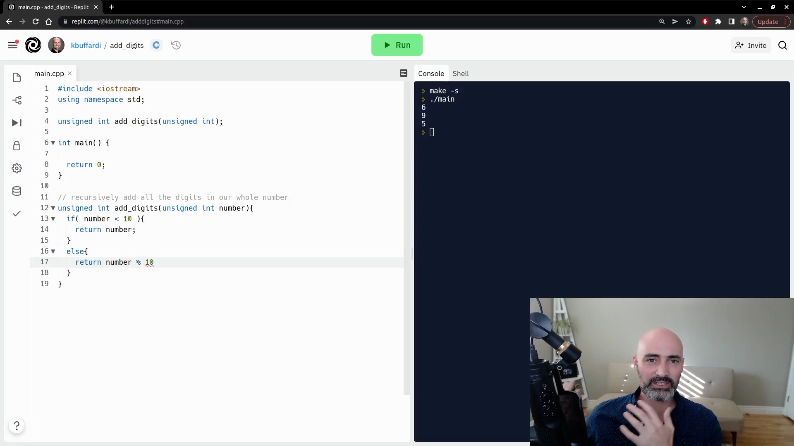
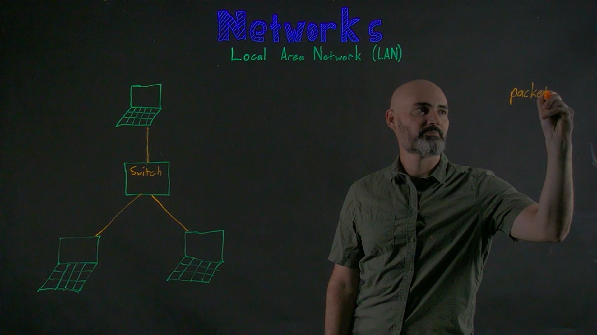
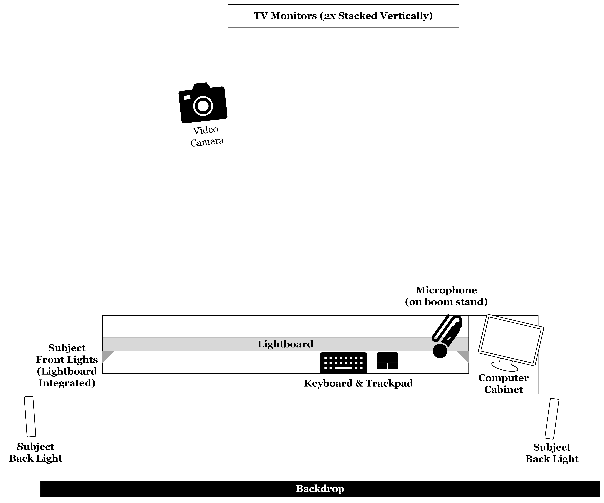

```{r setup, include=FALSE}
knitr::opts_chunk$set(echo = FALSE)
```
        
## Presentation

Presented at the [Consortium for Computing Sciences in Colleges: Southwest](https://ccsc.org/southwestern/2023/) in Irvine, California and published in the *Journal for Computing Sciences in Colleges*.

This presentation is accessible at [learnbyfailure.com/Codevid](https://learnbyfailure.com/CodeVid/) 
and its source is available on [GitHub](https://github.com/kbuffardi/CodeVid/).

## Issues in Teaching Coding Skills

* **Increasing demand for online learning**
    * Covid-19 Pandemic "Zoom University"
    * Massive Open Online Courses (MOOC)
    * Online degrees
    
* **Challenges teaching coding online**
    * Trade-offs between live coding, illustrations, gestures/emotions, etc.

## Multimedia Learning Principles
  
[](https://www.wiley.com/en-us/e+Learning+and+the+Science+of+Instruction:+Proven+Guidelines+for+Consumers+and+Designers+of+Multimedia+Learning,+4th+Edition-p-9781119158660)

* Evidence-based Principles of Multimedia and e-Learning

## Cognitive Load and Learning

* Amount of demand on brain's *working memory*
* Distributing presentation across multiple modes of communication *decreases* cognitive load ([Mousavi et al.-1995](https://psycnet.apa.org/doi/10.1037/0022-0663.87.2.319))
* Multimedia and e-Learning Principles (Clark \& Mayer):
    * **Multimedia Principle**: {text + graphics} > {text}
    * **Signaling Principle**: signal most important information to pay attention to
    * **Contiguity Principle**: related information should be presented in close spatial and temporal proximity
    * **Modality Principle**: {audio + graphics} > {text + graphics}
    
* Students tend to reflect positive emotions witnessed from instructor ([Lawson and Mayer-2022](https://doi.org/10.1016/j.cedpsych.2022.102080))

## Common "Zoom University" Presentation

* Screen share
* Camera share
    - Picture-in-picture
    
    

## Lightboard Presentation

* Transparent markerboard with video camera
    - Flipped image for natural writing/drawing
    

## Innovating the "CodeVid Studio"

* [HEERF funding for educational resiliency](https://www2.ed.gov/about/offices/list/ope/arp.html)
    - Integrating lightboard with IDE screen sharing
    

---

<iframe width="560" height="315" src="https://www.youtube.com/embed/_GWFVNvcEOs?start=312" title="YouTube video player" frameborder="0" allow="accelerometer; autoplay; clipboard-write; encrypted-media; gyroscope; picture-in-picture; web-share" allowfullscreen></iframe>


## CodeVid Studio In-Person


## CodeVid Studio Design



## Usability Study

* As part of [Codewit.us](https://codewit.us/) usability study
* Computer Science student participants (n=10)
    - CS1 passed, enrolled in CS2
* Protocol
    - Interview on experience/attitudes on CS1 homework/reading material
    - Intervention: tutorial on recursion
      - Randomly assigned intervention: picture-in-picture (n=5) or CodeVid Studio (n=5)
      - Independent programming challenge on recursion
    - Debrief: attitudes and feedback on experience

## Results

* **"The video feature was helpful."** *(1 strongly disagree to 5 strongly agree)*
    - **CodeVid Studio**: M=5, s.d.=0
    - **Picture-in-Picture**: M=4.8, s.d.=0.2
    
* **"What did you like least about the website"**
    - **CodeVid Studio**: *(nothing video-related)*
    - **Picture-in-Picture**:  the video would be better with
visuals/graphics to illustrate the topic

## Conclusions

* Novel presentation of text + graphics + presenter for teaching coding skills
    - Theoretical advantages based on evidence-based principles
* Pilot videos integrated into [Codewit.us beta release](https://codewit.us/)
* Positive formative feedback from usability study

**Future Work**

* Experimental study of cognitive load and learning effectiveness
* Platforming perspectives from historically marginalized groups, relating coding to their lives
    - ["Coding Community" supported by California Office of Planning and Research, Learning Labs](https://calearninglab.org/project/coding-community-inclusive-space-for-programming-tutorials-and-adaptive-learning/)


<!--
# Full Paper

The full paper will be available soon via *Journal for Computing Sciences in Colleges*.


[ACM Digital library](https://url/)

To cite this paper, use the following reference in your bibliography:

> Citation TBD

Or import the following *BibTeX* reference:

```
@inproceedings{TBD}
```

-->
